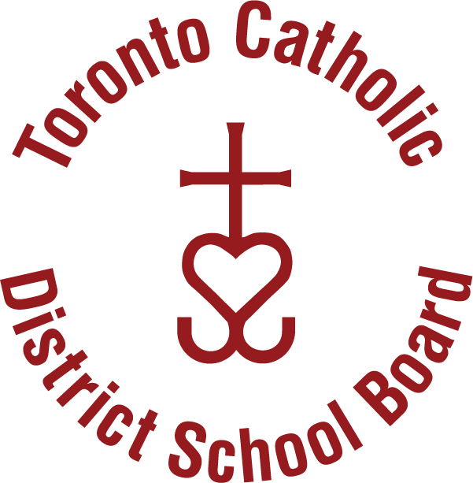

This document confirms that the TCDSB `_brand.yml` is being picked up.
Primary colour (`#951B1E` maroon) is applied to links and Bootstrap tokens.
Body text and headings use **Century Gothic** from the brand typography settings.

## Typography

Heading styles inherit `Century Gothic` from `brand.typography.headings`.

### Level 3 heading

Normal body text in the base font.

## Colour

The primary brand colour is used for links and interactive elements:

- [A branded link to this page](#) — should render in maroon
- `--bs-primary` maps to `#951B1E`

## Logos

::: {layout-ncol=2}
{width=200}

{width=200}
:::
